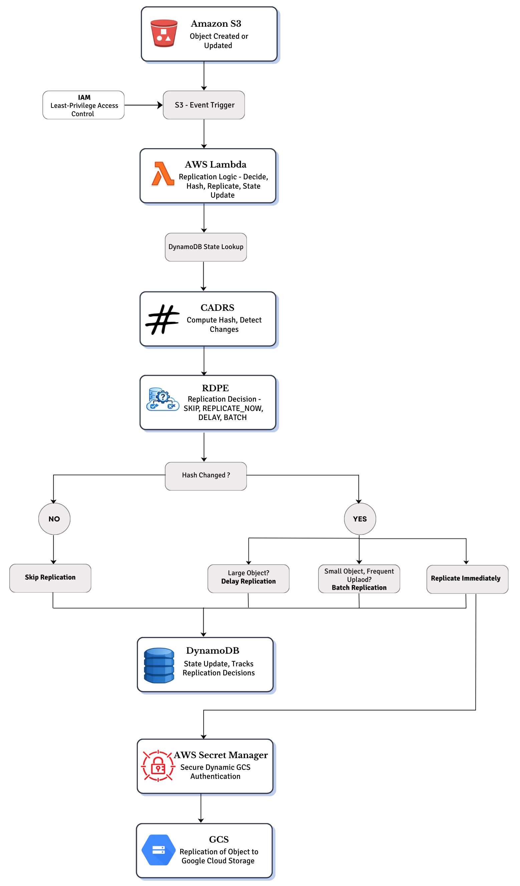
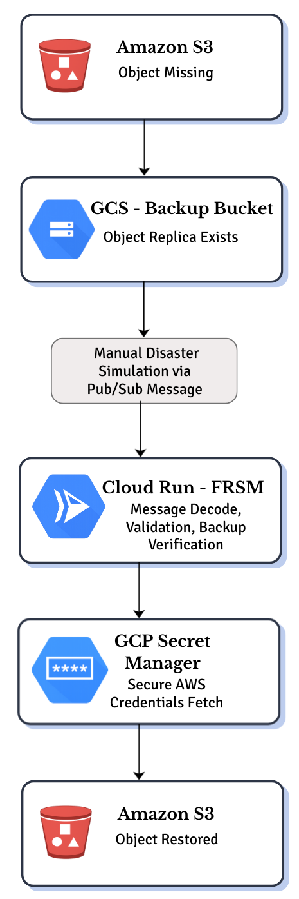

# Decision-Driven Cross-Cloud Disaster Recovery with Fail-Safe Restoration for Object Storage

A serverless, decision-driven disaster recovery system that replicates objects between **AWS** and **GCP** using content-aware deduplication and policy-based rules, with a manually-gated restoration pipeline to prevent accidental recovery.

Published at the 2026 IEEE International Conference on Contemporary Computing and Communications (InC4).
📄 Full paper: [`Cross_Cloud_final_Cam_ready.pdf`](./Cross_Cloud_final_Cam_ready.pdf)

---

## Why this exists

Conventional cross-cloud DR tools re-copy entire objects on every change, treat all data the same regardless of size/importance, and risk unwanted bidirectional sync during recovery. This project fixes that with three components:

- **CADRS** – SHA-256 content hashing to skip redundant transfers
- **RDPE** – a policy engine that decides *how* to replicate, based on object size and update frequency
- **FRSM** – a fail-safe, manually-triggered restoration mechanism (no auto-recovery)

---

## Architecture

### 1. AWS → GCP Replication Pipeline

S3 event triggers Lambda, which hashes the object (CADRS), consults DynamoDB state, and RDPE decides: **Skip / Replicate Now / Delay / Batch**.



### 2. GCP → AWS Recovery Pipeline

Recovery only happens on an explicit, manually published Pub/Sub message — Cloud Run validates it and restores the object to S3.



---

## Repo Structure

```
.
├── lambda_aws.py                  # AWS Lambda: S3 trigger, CADRS hashing, RDPE policy, DynamoDB updates
├── GCP restoration cloud run.py   # GCP Cloud Run: FRSM restoration logic
├── Literature survey/             # Reference papers
├── Cross_Cloud_final_Cam_ready.pdf
└── .gitignore
```

---

## Highlights from the Paper

- Eliminated **9/10 redundant transfers** in repeated-upload tests via CADRS
- RDPE correctly classified all test cases across SKIP / REPLICATE_NOW / DELAY / BATCH
- Estimated cost: **~$1.8/month** for 1,000 uploads and 10 GB replicated data
- Object-level failure isolation with automatic retry for pending replications

For full results, cost breakdown, comparison with tools like AWS DataSync/Skyplane, and limitations, see the paper.

---

## Citation

R. Keerthana Prasad, N. Sukhitha Bhushan, and Aparna R, "Decision-Driven Cross-Cloud Disaster Recovery with Fail-Safe Restoration for Object Storage," 2026 IEEE InC4.
